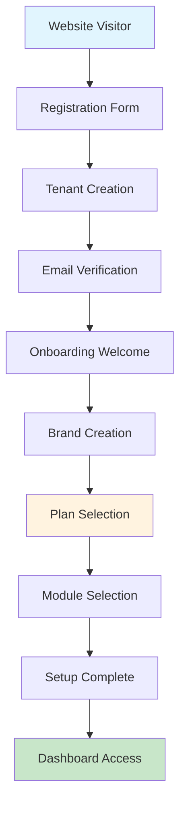

# User Journey Flow Diagram

## Complete Registration to Dashboard Flow

```
┌─────────────────────────────────────────────────────────────────────────────────────┐
│                                REGISTRATION PHASE                                   │
└─────────────────────────────────────────────────────────────────────────────────────┘

    ┌─────────────┐    ┌─────────────┐    ┌─────────────┐    ┌─────────────┐
    │   Website   │───▶│ Registration│───▶│   Tenant    │───▶│   Email     │
    │   Visitor   │    │    Form     │    │  Creation   │    │Verification │
    └─────────────┘    └─────────────┘    └─────────────┘    └─────────────┘
                              │                   │                   │
                              ▼                   ▼                   ▼
                       ┌─────────────┐    ┌─────────────┐    ┌─────────────┐
                       │• Name       │    │• Database   │    │• Send Email │
                       │• Email      │    │• Domain     │    │• Token      │
                       │• Password   │    │• Customer   │    │• Verify     │
                       │• Company    │    │• User       │    │• Activate   │
                       │• Country    │    │• Migration  │    │• Redirect   │
                       └─────────────┘    └─────────────┘    └─────────────┘

┌─────────────────────────────────────────────────────────────────────────────────────┐
│                                ONBOARDING PHASE                                     │
└─────────────────────────────────────────────────────────────────────────────────────┘

    ┌─────────────┐    ┌─────────────┐    ┌─────────────┐    ┌─────────────┐
    │  Welcome    │───▶│   Brand     │───▶│    Plan     │───▶│   Module    │
    │   Screen    │    │  Creation   │    │ Selection   │    │ Selection   │
    └─────────────┘    └─────────────┘    └─────────────┘    └─────────────┘
           │                   │                   │                   │
           ▼                   ▼                   ▼                   ▼
    ┌─────────────┐    ┌─────────────┐    ┌─────────────┐    ┌─────────────┐
    │• Welcome    │    │• Brand Name │    │• Starter    │    │• HR         │
    │• Progress   │    │• Description│    │• Pro ⭐     │    │• CRM        │
    │• Overview   │    │• Country    │    │• Enterprise │    │• Surveys    │
    │• Get Started│    │• Industry   │    │• Free Trial │    │• Inventory  │
    └─────────────┘    └─────────────┘    └─────────────┘    └─────────────┘

┌─────────────────────────────────────────────────────────────────────────────────────┐
│                               COMPLETION PHASE                                      │
└─────────────────────────────────────────────────────────────────────────────────────┘

    ┌─────────────┐    ┌─────────────┐    ┌─────────────┐    ┌─────────────┐
    │ Onboarding  │───▶│ Subscription│───▶│  Dashboard  │───▶│   Active    │
    │  Complete   │    │   Created   │    │   Access    │    │    User     │
    └─────────────┘    └─────────────┘    └─────────────┘    └─────────────┘
           │                   │                   │                   │
           ▼                   ▼                   ▼                   ▼
    ┌─────────────┐    ┌─────────────┐    ┌─────────────┐    ┌─────────────┐
    │• Success    │    │• Trial      │    │• Tenant     │    │• Full       │
    │• Summary    │    │• 14 Days    │    │• Brand      │    │• Access     │
    │• Next Steps │    │• Free       │    │• Modules    │    │• Features   │
    │• Go to Dash │    │• Auto-renew │    │• Trial Info │    │• Support    │
    └─────────────┘    └─────────────┘    └─────────────┘    └─────────────┘
```

## Detailed Process Flow

### 1. Registration & Tenant Creation
```
User Input ──┐
             ├─► Validation ──► Tenant Creation ──► Database Setup ──► User Creation
Country     ─┘                      │                    │                  │
Category                            ▼                    ▼                  ▼
                              ┌──────────┐        ┌──────────┐       ┌──────────┐
                              │ Landlord │        │  Tenant  │       │  Email   │
                              │    DB    │        │    DB    │       │ Verification│
                              │• Tenant  │        │• Schema  │       │• Token   │
                              │• Customer│        │• Migrate │       │• Queue   │
                              └──────────┘        └──────────┘       └──────────┘
```

### 2. Onboarding Flow
```
Email Verified ──► Onboarding Check ──► Brand Creation ──► Plan Selection ──► Module Selection
       │                    │                  │                │                  │
       ▼                    ▼                  ▼                ▼                  ▼
┌──────────┐        ┌──────────┐       ┌──────────┐    ┌──────────┐       ┌──────────┐
│Middleware│        │No Brands │       │  Brand   │    │   Plan   │       │ Modules  │
│  Check   │        │  Found   │       │ Metadata │    │Subscription│     │Selection │
│Redirect  │        │Redirect  │       │  Store   │    │ Trial    │       │ Store    │
└──────────┘        └──────────┘       └──────────┘    └──────────┘       └──────────┘
```

### 3. Subscription & Trial Management
```
Plan Selected ──► Subscription Created ──► Trial Started ──► Dashboard Access
      │                    │                     │                  │
      ▼                    ▼                     ▼                  ▼
┌──────────┐        ┌──────────┐         ┌──────────┐       ┌──────────┐
│• Plan ID │        │• Brand   │         │• 14 Days │       │• Tenant  │
│• Currency│        │• User    │         │• Free    │       │• Brand   │
│• Billing │        │• Trial   │         │• Full    │       │• Modules │
│• Modules │        │• Status  │         │• Access  │       │• Trial   │
└──────────┘        └──────────┘         └──────────┘       └──────────┘
```

## Database Relationship Flow

```
┌─────────────────┐
│     TENANT      │ (Organization)
│   ┌─────────┐   │
│   │ Domain  │   │ ──► tenant1.app.com
│   │Database │   │ ──► tenant1_db
│   └─────────┘   │
└─────────┬───────┘
          │ 1:N
          ▼
┌─────────────────┐
│     BRAND       │ (Product Line)
│   ┌─────────┐   │
│   │  Name   │   │ ──► "Acme SaaS"
│   │Metadata │   │ ──► {modules: [...], onboarding: true}
│   └─────────┘   │
└─────────┬───────┘
          │ 1:N
          ▼
┌─────────────────┐    ┌─────────────────┐
│  SUBSCRIPTION   │◄──►│      USER       │
│   ┌─────────┐   │    │   ┌─────────┐   │
│   │  Plan   │   │    │   │  Auth   │   │
│   │ Trial   │   │    │   │Profile  │   │
│   │Billing  │   │    │   │ Roles   │   │
│   └─────────┘   │    │   └─────────┘   │
└─────────────────┘    └─────────────────┘
```

## Module Integration Flow

```
Selected Modules ──► Dashboard Sidebar ──► Module Routes ──► Feature Access
       │                     │                   │                │
       ▼                     ▼                   ▼                ▼
┌──────────┐          ┌──────────┐        ┌──────────┐     ┌──────────┐
│• HR      │          │• HR Menu │        │• HR      │     │• Employee│
│• CRM     │   ────► │• CRM Menu│ ────► │• CRM     │ ──► │• Contacts│
│• Surveys │          │• Survey  │        │• Survey  │     │• Forms   │
│• Other   │          │• Other   │        │• Other   │     │• Reports │
└──────────┘          └──────────┘        └──────────┘     └──────────┘
```

## Trial to Paid Conversion Flow

```
Trial Active ──► Trial Warning ──► Trial Expired ──► Payment Required
     │               │                  │                   │
     ▼               ▼                  ▼                   ▼
┌──────────┐   ┌──────────┐      ┌──────────┐       ┌──────────┐
│14 Days   │   │7,3,1 Days│      │Grace     │       │Payment   │
│Full      │   │Reminders │      │Period    │       │Gateway   │
│Access    │   │Email/UI  │      │3 Days    │       │Setup     │
└──────────┘   └──────────┘      └──────────┘       └──────────┘
                                        │                   │
                                        ▼                   ▼
                                 ┌──────────┐       ┌──────────┐
                                 │Suspend   │       │Active    │
                                 │Account   │       │Paid      │
                                 │Limited   │       │Full      │
                                 └──────────┘       └──────────┘
```

## Error Handling Flow

```
User Action ──► Validation ──► Success ──► Next Step
     │              │             │
     │              ▼             │
     │         ┌──────────┐       │
     │         │  Error   │       │
     │         │ Detected │       │
     │         └──────────┘       │
     │              │             │
     ▼              ▼             ▼
┌──────────┐   ┌──────────┐  ┌──────────┐
│Retry     │   │Show      │  │Continue  │
│Action    │◄──│Error     │  │Process   │
│Form      │   │Message   │  │Flow      │
└──────────┘   └──────────┘  └──────────┘
```

## Visual Diagram Creation Instructions

To create a professional visual diagram, use one of these tools:

### 1. Lucidchart
```
1. Go to lucidchart.com
2. Create new flowchart
3. Use shapes: Rectangles (processes), Diamonds (decisions), Circles (start/end)
4. Colors: Blue (registration), Green (onboarding), Orange (completion)
5. Export as PNG/SVG
```

### 2. Draw.io (diagrams.net)
```
1. Go to app.diagrams.net
2. Choose "Flowchart" template
3. Drag and drop shapes
4. Use consistent styling
5. Save to documentation/cycles/
```

### 3. Mermaid (Code-based)


### 4. Recommended Visual Elements
- **Colors**: Blue (start), Green (success), Orange (process), Red (error)
- **Icons**: User, building, gift, puzzle piece, dashboard
- **Arrows**: Solid (main flow), dashed (optional), curved (loops)
- **Grouping**: Boxes around related processes
- **Annotations**: Numbers for step sequence

## File Locations for Diagrams

Save visual diagrams in:
```
/documentation/cycles/
├── user-journey-flow.png
├── database-relationships.svg
├── onboarding-process.pdf
├── trial-conversion-flow.png
└── error-handling-diagram.svg
```

## Interactive Diagram (Future Enhancement)

Consider creating an interactive version using:
- **D3.js**: For web-based interactive diagrams
- **React Flow**: For component-based flow diagrams
- **Cytoscape.js**: For complex relationship visualizations

This would allow users to:
- Click through the actual flow
- See real data at each step
- Understand the process better
- Debug issues more effectively
