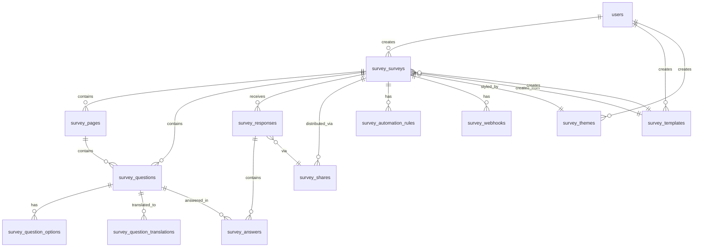

# Survey Module ERD (Entity Relationship Diagram)

## Overview
Full-featured Survey module with DDD architecture supporting 20 question types, multi-page surveys, branching logic, quizzes/scoring, and multi-language support.

---

## Entity Relationship Diagram

---

## Table Definitions

### survey_surveys
Main survey entity with settings and status.

| Column | Type | Constraints | Description |
|--------|------|-------------|-------------|
| id | bigint | PK | Auto-increment |
| title | string(255) | NOT NULL | Survey title |
| description | text | NULL | Survey description |
| status | enum | DEFAULT 'draft' | draft, active, paused, closed, archived |
| settings | json | NULL | Survey configuration |
| theme_id | bigint | FK → survey_themes | Visual theme |
| template_id | bigint | FK → survey_templates | Source template |
| default_locale | string(10) | DEFAULT 'en' | Default language |
| supported_locales | json | NULL | Available languages |
| published_at | timestamp | NULL | When published |
| closed_at | timestamp | NULL | When closed |
| created_by | bigint | FK → users | Creator |
| created_at | timestamp | | Creation time |
| updated_at | timestamp | | Last update |
| deleted_at | timestamp | NULL | Soft delete |

**Indexes:** status, created_by, theme_id

---

### survey_pages
Pages within a survey for multi-page mode.

| Column | Type | Constraints | Description |
|--------|------|-------------|-------------|
| id | bigint | PK | Auto-increment |
| survey_id | bigint | FK → survey_surveys, CASCADE | Parent survey |
| title | string(255) | NULL | Page title |
| description | text | NULL | Page description |
| order | int | NOT NULL | Display order |
| settings | json | NULL | Page settings |
| created_at | timestamp | | Creation time |
| updated_at | timestamp | | Last update |

**Indexes:** survey_id, order

---

### survey_questions
Questions within pages (20 types supported).

| Column | Type | Constraints | Description |
|--------|------|-------------|-------------|
| id | bigint | PK | Auto-increment |
| survey_id | bigint | FK → survey_surveys, CASCADE | Parent survey |
| page_id | bigint | FK → survey_pages, CASCADE | Parent page |
| type | enum | NOT NULL | Question type (20 options) |
| title | string(500) | NOT NULL | Question text |
| description | text | NULL | Helper text |
| help_text | text | NULL | Additional help |
| is_required | boolean | DEFAULT false | Mandatory answer |
| order | int | NOT NULL | Display order |
| config | json | NULL | Type-specific config |
| validation | json | NULL | Validation rules |
| branching | json | NULL | Skip/show logic |
| correct_answer | json | NULL | Quiz answer |
| image_url | string(500) | NULL | Question image |
| created_at | timestamp | | Creation time |
| updated_at | timestamp | | Last update |

**Indexes:** survey_id, page_id, type, order

**Question Types:**
- text, textarea, email, number, phone, url, date
- multiple_choice, checkbox, dropdown, rating, nps
- likert_scale, matrix, slider, file_upload, image_choice
- ranking, yes_no, signature

---

### survey_question_options
Options for choice-based questions.

| Column | Type | Constraints | Description |
|--------|------|-------------|-------------|
| id | bigint | PK | Auto-increment |
| question_id | bigint | FK → survey_questions, CASCADE | Parent question |
| label | string(255) | NOT NULL | Display text |
| value | string(255) | NOT NULL | Stored value |
| order | int | NOT NULL | Display order |
| image_url | string(500) | NULL | Option image |
| is_other | boolean | DEFAULT false | "Other" option |
| point_value | int | DEFAULT 0 | Quiz scoring |
| created_at | timestamp | | Creation time |
| updated_at | timestamp | | Last update |

**Indexes:** question_id, order

---

### survey_question_translations
Multi-language content for questions.

| Column | Type | Constraints | Description |
|--------|------|-------------|-------------|
| id | bigint | PK | Auto-increment |
| question_id | bigint | FK → survey_questions, CASCADE | Parent question |
| locale | string(10) | NOT NULL | Language code |
| title | string(500) | NULL | Translated title |
| description | text | NULL | Translated description |
| help_text | text | NULL | Translated help |
| options_translations | json | NULL | Option translations |
| created_at | timestamp | | Creation time |
| updated_at | timestamp | | Last update |

**Unique:** question_id + locale

---

### survey_responses
Individual survey responses from respondents.

| Column | Type | Constraints | Description |
|--------|------|-------------|-------------|
| id | bigint | PK | Auto-increment |
| survey_id | bigint | FK → survey_surveys, CASCADE | Parent survey |
| share_id | bigint | FK → survey_shares | Distribution channel |
| respondent_type | enum | NOT NULL | anonymous, authenticated, email |
| respondent_id | bigint | FK → users | User if authenticated |
| respondent_email | string(255) | NULL | Email if provided |
| respondent_name | string(255) | NULL | Name if provided |
| status | enum | DEFAULT 'started' | started, completed, partial, disqualified |
| started_at | timestamp | NULL | When started |
| completed_at | timestamp | NULL | When completed |
| ip_address | string(45) | NULL | Respondent IP |
| user_agent | text | NULL | Browser info |
| time_spent_seconds | int | NULL | Total time |
| score | int | NULL | Quiz score |
| max_score | int | NULL | Maximum possible |
| passed | boolean | NULL | Pass/fail result |
| resume_token | string(64) | UNIQUE | For resuming |
| locale | string(10) | DEFAULT 'en' | Response language |
| custom_fields | json | NULL | Additional data |
| created_at | timestamp | | Creation time |
| updated_at | timestamp | | Last update |

**Indexes:** survey_id, share_id, status, resume_token

---

### survey_answers
Individual answers within a response.

| Column | Type | Constraints | Description |
|--------|------|-------------|-------------|
| id | bigint | PK | Auto-increment |
| response_id | bigint | FK → survey_responses, CASCADE | Parent response |
| question_id | bigint | FK → survey_questions | Question answered |
| value | text | NULL | Text answer |
| selected_options | json | NULL | Choice answers |
| file_id | bigint | FK → files | Uploaded file |
| matrix_answers | json | NULL | Matrix responses |
| rating_value | int | NULL | Rating value |
| computed_score | int | NULL | Points earned |
| created_at | timestamp | | Creation time |
| updated_at | timestamp | | Last update |

**Indexes:** response_id, question_id

---

### survey_templates
Reusable survey templates (system + custom).

| Column | Type | Constraints | Description |
|--------|------|-------------|-------------|
| id | bigint | PK | Auto-increment |
| name | string(255) | NOT NULL | Template name |
| description | text | NULL | Description |
| category | enum | NOT NULL | Template category |
| structure | json | NOT NULL | Question/page structure |
| is_system | boolean | DEFAULT false | System template |
| created_by | bigint | FK → users, NULL | Creator (NULL for system) |
| created_at | timestamp | | Creation time |
| updated_at | timestamp | | Last update |
| deleted_at | timestamp | NULL | Soft delete |

**Categories:** customer_satisfaction, employee_engagement, market_research, product_feedback, event_feedback, nps, csat, ces, education, health, general, 360_feedback, course_evaluation

**Indexes:** category, is_system

---

### survey_themes
Visual styling themes for surveys.

| Column | Type | Constraints | Description |
|--------|------|-------------|-------------|
| id | bigint | PK | Auto-increment |
| name | string(255) | NOT NULL | Theme name |
| colors | json | NULL | Color palette |
| font_family | string(100) | NULL | Typography |
| logo_url | string(500) | NULL | Brand logo |
| background_image_url | string(500) | NULL | Background image |
| button_style | json | NULL | Button customization |
| is_system | boolean | DEFAULT false | System theme |
| created_by | bigint | FK → users | Creator |
| created_at | timestamp | | Creation time |
| updated_at | timestamp | | Last update |
| deleted_at | timestamp | NULL | Soft delete |

**Indexes:** is_system

---

### survey_automation_rules
Automation triggers and actions.

| Column | Type | Constraints | Description |
|--------|------|-------------|-------------|
| id | bigint | PK | Auto-increment |
| survey_id | bigint | FK → survey_surveys, CASCADE | Parent survey |
| name | string(255) | NOT NULL | Rule name |
| trigger_type | enum | NOT NULL | When to trigger |
| conditions | json | NULL | Filter conditions |
| action_type | enum | NOT NULL | What to do |
| action_config | json | NOT NULL | Action parameters |
| is_active | boolean | DEFAULT true | Enabled status |
| created_by | bigint | FK → users | Creator |
| created_at | timestamp | | Creation time |
| updated_at | timestamp | | Last update |
| deleted_at | timestamp | NULL | Soft delete |

**Triggers:** response_created, response_completed, question_answered, threshold_met

**Actions:** send_email, update_field, create_activity, send_notification, trigger_webhook, create_crm_activity

---

### survey_webhooks
Outbound webhooks for integrations.

| Column | Type | Constraints | Description |
|--------|------|-------------|-------------|
| id | bigint | PK | Auto-increment |
| survey_id | bigint | FK → survey_surveys, CASCADE | Parent survey |
| name | string(255) | NOT NULL | Webhook name |
| url | string(500) | NOT NULL | Target URL |
| secret | string(255) | NOT NULL | HMAC secret |
| events | json | NOT NULL | Subscribed events |
| is_active | boolean | DEFAULT true | Enabled status |
| last_triggered_at | timestamp | NULL | Last call time |
| created_by | bigint | FK → users | Creator |
| created_at | timestamp | | Creation time |
| updated_at | timestamp | | Last update |
| deleted_at | timestamp | NULL | Soft delete |

**Indexes:** survey_id, is_active

---

### survey_shares
Distribution channels for surveys.

| Column | Type | Constraints | Description |
|--------|------|-------------|-------------|
| id | bigint | PK | Auto-increment |
| survey_id | bigint | FK → survey_surveys, CASCADE | Parent survey |
| channel | enum | NOT NULL | Distribution type |
| token | string(64) | UNIQUE | Share token |
| config | json | NULL | Channel config |
| max_uses | int | NULL | Usage limit |
| uses_count | int | DEFAULT 0 | Current uses |
| expires_at | timestamp | NULL | Expiration |
| created_by | bigint | FK → users | Creator |
| created_at | timestamp | | Creation time |
| updated_at | timestamp | | Last update |

**Channels:** email, link, embed, sms, qr_code, social

**Indexes:** survey_id, channel, token, expires_at

---

## Relationships Summary

| Parent | Child | Type | On Delete |
|--------|-------|------|-----------|
| survey_surveys | survey_pages | 1:N | CASCADE |
| survey_surveys | survey_questions | 1:N | CASCADE |
| survey_surveys | survey_responses | 1:N | CASCADE |
| survey_surveys | survey_shares | 1:N | CASCADE |
| survey_surveys | survey_automation_rules | 1:N | CASCADE |
| survey_surveys | survey_webhooks | 1:N | CASCADE |
| survey_surveys | survey_themes | N:1 | SET NULL |
| survey_surveys | survey_templates | N:1 | SET NULL |
| survey_pages | survey_questions | 1:N | CASCADE |
| survey_questions | survey_question_options | 1:N | CASCADE |
| survey_questions | survey_question_translations | 1:N | CASCADE |
| survey_questions | survey_answers | 1:N | RESTRICT |
| survey_responses | survey_answers | 1:N | CASCADE |
| survey_responses | survey_shares | N:1 | SET NULL |
| users | survey_surveys | 1:N | - |
| users | survey_templates | 1:N | - |
| users | survey_themes | 1:N | - |

---

## Indexes Summary

**survey_surveys:** status, created_by, theme_id, template_id
**survey_pages:** (survey_id, order)
**survey_questions:** (survey_id, page_id, order), type
**survey_question_options:** (question_id, order)
**survey_question_translations:** UNIQUE (question_id, locale)
**survey_responses:** (survey_id, status), share_id, resume_token
**survey_answers:** (response_id, question_id)
**survey_shares:** (survey_id, channel), token, expires_at
**survey_templates:** category, is_system
**survey_automation_rules:** survey_id
**survey_webhooks:** (survey_id, is_active)

---

## Total Tables: 12

1. survey_surveys
2. survey_pages
3. survey_questions
4. survey_question_options
5. survey_question_translations
6. survey_responses
7. survey_answers
8. survey_templates
9. survey_themes
10. survey_automation_rules
11. survey_webhooks
12. survey_shares
